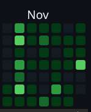

# Times: 基于RSSHub 与 Friend-Circle-Lite 的学院通知聚合网站

::github{repo="DIYgod/RSSHub"}
::github{repo="willow-god/Friend-Circle-Lite"}

有人似乎半个月没更新博客了（（（

但倒是度过了还算充实的半个月，从 Github 热力图上便可见一斑。



周末闲下来了不妨讲讲这半个月都干了什么，就从 Times 开始好了。

## 起因

之前跟别人聊天的时候曾经开玩笑地说过

> 对我来说，信息就是生命

这样的话。所以我在生活中也挺留意学校和其他的一些通知。
早获得信息、早做打算、早想对策，于我而言大概算是一种习惯。

所以我闲着没事的时候就回去刷新一下学校的各个通知网站，
像是本科生院、学科竞赛、本科生跨国(境)、跨校交流网一类的。

于是就有一个显而易见的问题：**通知太“散”了。**
基本上为了查看有没有最新通知要去看好几个网站，就很麻烦。
但当时也没想到什么好的解决法子，就先凑合用着了。

## 契机

之前有段时间了解过一点点 RSS ，
也听说过 [RSSHub](https://docs.rsshub.app/) 这个为不提供 RSS 订阅的网站添加 RSS 解析的项目，
但当时也仅仅是作为一个订阅链接的“使用者”，
况且发现由于学校网站迁移，之前前辈写好的 RSSHub 路由不能用了，
也就没有深入了解下去。

上个月给这个博客网站添加了友链朋友圈功能后（见[这篇博文](../2025111000/)），
我突然发现“这玩意拿来抓学校通知刚刚好”。
本着有自用需求的想法，我忽悠 [FrozenStarrrr](https://github.com/FrozenStarrrr) 重启暑假搁置掉的 Minus 计划。
刚刚好那周我们专业要进行分流，
也带有一点点“做出来的话可以当面试资本”的私心在。

## 结构

从这一小节开始正式进入具体介绍项目环节。

~~fuwari 怎么没有 mermaid 支持草~~

```ascii
                                -----------------
---------------------  RSSHub   |     .xml      |
| School's websites |---------->|      on       |
---------------------           | RSSHub Server |
                                -----------------
                                        |
                        ----------------| Friend-Circle-Lite
                        |               |
                        v               v
                ---------------    ------------
                | Github Page |    | all.json |
                ---------------    ------------

// 手搓只能画成这样了凑合看吧
```

基本思路就是

1. 编写路由解析学校网站的通知公告页面
2. 部署 RSSHub 服务器（当然我们小作坊没钱高服务器只能找其他办法）
3. 利用友链朋友圈定时抓取上一步生成的 `.xml` 文件
4. 生成静态页面，部署到 Github Page 上

## 编写路由

因为学校的本科生院网站完全就是把之前教务处网站换了个域名。
而 [棒无](https://github.com/markbang) 前辈之前曾写过[教务处网站的路由](https://github.com/DIYgod/RSSHub/pull/15357)，
这使得我们可以参考 ~~抄~~ 前辈留下来的 `.ts` 文件照葫芦画瓢，
先将
[本科生院的路由](https://github.com/DIYgod/RSSHub/pull/20515)
和
[自家学院的路由](https://github.com/DIYgod/RSSHub/pull/20531)
写好。

写完两个路由，也差不多有了点经验。
接下来的几周我们陆续又写完了其他 25 个学院的路由
（[PR#20532](https://github.com/DIYgod/RSSHub/pull/20532),
[PR#20582](https://github.com/DIYgod/RSSHub/pull/20582)）。
这也是目前路由的完成情况，
有关于更详细的路由支持计划，
您可以查看我们 Fork 仓库的 [Issue#1](https://github.com/ECNU-minus/RSSHub/issues/1)。

由于作为一个仅有三人的小作坊，
我们属实没钱也没有什么网络安全经验去维护一台服务器，
所以我们只能依赖公共实例或是 Github Actions 。
无论哪种我们都需要将自己写的路由提 PR 给原 repo。
所以有一周基本上就是在
`写路由 -> 提PR -> 查看CR评论 -> 改路由`
的循环中度过的。

~~考虑到 RSSHub 的规模，我似乎可以不要脸的说自己也是给 stars 项目提过 pr 的人~~

## 部署友链朋友圈

这一步基本照着文档来就行，
但考虑到抓取通知毕竟和项目原目的不一样，
还是需要做一些更改。

### 修改读取 `json` 路径

```yaml title="./conf.yaml" {3}
spider_settings:
  enable: true
  json_url: "https://raw.githubusercontent.com/ECNU-minus/Friend-Circle-Lite/main/sites.json"
  ...
```

对于新增学院的信息按照文档给定格式写入 Fork 仓库根目录下的 `sites.json` 文件

由于 RSSHub 生成的订阅路径特殊，
不能由 `site.json` 中的链接自动解析，
需要在 `conf.yaml` 中自行执行 RSS 地址

```yaml title="conf.yaml"
# 特殊RSS地址指定，可以置空但是不要删除！
# 解释：用于指定特殊RSS地址，如B站专栏等不常见RSS地址后缀，可以添加多个
#   name:               友链名称
#   url:                指定的RSS地址
specific_RSS:
  - name: 学院名称
    url: RSS 订阅地址
```

### 添加学院 logo

这一步对我来说是比较难受的一步，
需要去各个学院官网手动找到院徽下载转成 `.webp` 格式然后统统塞入 `./assets/` 文件夹下。
理想状态是点开学院官网就能从学院详情直接下载到透明背景的图片，
至于实际操作下来嘛……

- 数院化院还有几个学院没有院徽
- 计院只能找到蓝底的院徽
- 传播学院给了 `.ai` 格式的文件倒是还能理解但是美术学院竟然只提供 `.pdf` 格式的文件
  ~~不是，为什么要用 `.pdf` 存图片啊~~

最后官网找不到的只好去下载微信公众号头像，
没设计院徽的学院就只能用校徽替代，
才总算凑了个七七八八。

### 功能调整

#### 更换默认壁纸

默认壁纸实在是太不二次元了，更换 `./static/bg-light.webp` 文件即可

#### 去掉首页

默认的友链朋友圈界面点开会是 `文档/接口` 页面，
需要往下滚动才能查看到文章，
容易使用户感到困惑，
故需要删掉相关代码

```html title="./static/index.html" del={3-12,16-29}
<style>
  ...
  .container {
      background: rgba(255, 255, 255, 0.8);
      display: flex;
      text-align: center;
      align-items: center;
      height: 100vh;
      width: 100%;
      flex-direction: column;
      justify-content: center;
  }
  ...
</style>
...
<div class="container">
  
  <p>Friend-Circle-Lite<br />服务已运行</p>
  <div class="button-container">
    <a
      href="https://blog.liushen.fun/posts/4dc716ec/"
      class="button"
      target="_blank"
      >查看文档</a
    >
    <a href="/all.json" class="button">测试接口</a>
  </div>
  <a href="#" class="scroll-down-icon" id="scroll-down-button"></a>
</div>
```

#### 修改文章抓取数目与抓取时间

设定每个学院抓取 8 篇文章（只是因为刚好凑个整又不至于太少）

```yaml title="./conf.yaml" "8"
spider_settings:
  ...
  article_count: 8
  ...
```

原仓库为抓取数目设定了默认 150 的上限，
超过了便会按照一定规则筛选作者，
考虑到学院数目较多，
故将上限改为 256 （同样凑个整）

```python title="./friend_circle_lite/all_friends.py" "256"
def deal_with_large_data(result):
    """
    处理文章数据，保留前150篇及其作者在后续文章中的出现。

    参数：
    result (dict): 包含统计数据和文章数据的字典。

    返回：
    dict: 处理后的数据，只包含需要的文章。
    """
    result = sort_articles_by_time(result)
    article_data = result.get("article_data", [])

    # 检查文章数量是否大于 150
    max_articles = 256
```

从 RSSHub 服务器抓取通常需要更长的时间，
默认设置的 15 秒很容易超时，
故将其修改为 60 秒。

```python title="./friend_circle_lite/__init__.py" "15"
timeout = (10, 15)
```

#### 添加筛选作者多选下拉栏

这部分扔给 FrozenStarrrr 处理的，我只提了需求没管具体实现。

## 生成静态页面

这部分主要是调 Actions ，感觉还算比较重要，故单拉出来一个二级标题。

- 域名

  原部署逻辑是在生成静态页面后初始化 git 仓库然后强制推送到 page 分支上，
  这样做的好处是 page 分支始终仅有 1 个 commit ，较为简洁，
  但是每次更新会清理掉 CNAME 文件，令自定义域名失效。
  故对 actions 做如下修改

  ```yml title=./.github/workflows/friend_circle_lite.yml add={6,7}
  - name: Commit changes
    run: |
      mkdir pages
      cp -r main ./static/index.html ./static/readme.md ./static/favicon.ico ./static/bg-light.webp ./temp/cache.json ./static/bg-dark.webp all.json errors.json pages/
      cd pages
      touch CNAME
      echo "times.myecnu.org" >> CNAME
      git init
      git add .
      git commit -m "⏱️ $(date +"%Y年%m月%d日-%H时%M分") GitHub Actions定时更新"
      git push --force https://x-access-token:${{ secrets.GITHUB_TOKEN }}@github.com/${{ github.repository }}.git HEAD:page
  ```

- 服务器

  一开始我们采用的是抓取远程公共实例的方式，
  但是这样会比较依赖远端服务器的稳定性，
  在问了伟大的ゲミニ様之后得知可以在 actions 里边通过拉取 docker 镜像提供服务。
  于是作如下修改

  ```yml title=./.github/workflows/friend_circle_lite.yml add={4-13}
  friend-circle-lite:
    runs-on: ubuntu-latest

    services:
      rsshub:
        image: diygod/rsshub:latest
        ports:
          - 1200:1200
        options: >-
          --health-cmd "curl -f http://localhost:1200/ || exit 1"
          --health-interval 10s
          --health-timeout 5s
          --health-retries 5
  ```

  然后将所有抓取链接指向 `localhost:1200` 即可。

## 后续计划？

当前虽然算是能用，但还是存在一些不足，后续可能会考虑对其进行进一步的修改。

### 支持更多网站

目前仅支持所有以 `<ul></ul>` 无序列表实现通知公告的网站（除了你，数院）
使用 `<table>` 和 `<div>` 实现的网站暂时还没写。
目前已经支持和打算支持的页面可以参照 Fork 仓库的 [Issue#1](https://github.com/ECNU-minus/RSSHub/issues/1) 页面。

以及数学科学学院网站采用 `gb2312` 编码，直接抓取会出现编码错误，
暂时还没想好怎么解决。

### 重写静态页面

审美不合

### 邮箱通知

当前还只能通过用户查看来被动查找信息，但友链朋友圈原仓库支持邮箱推送，
可以实现主动推送订阅通知，提升用户友好性。
基于此，下一步要做的是修改对应配置文件，支持用户订阅部分消息源的通知，并定时推送。

::github{repo="ECNU-minus/times"}

> 本文封面为作品[星空鉄道とシロの旅](http://shiratamaco.com/)中的 [CG](http://shiratamaco.com/assets/images/scrshots16.png)
