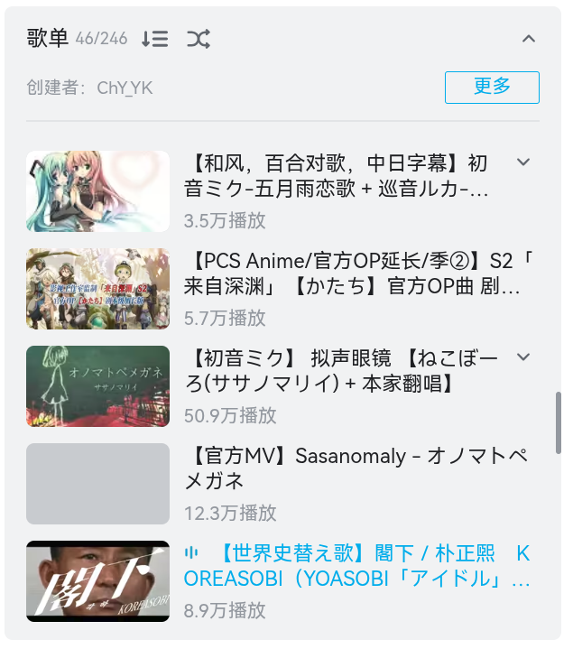
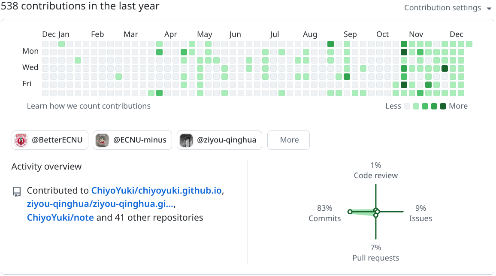
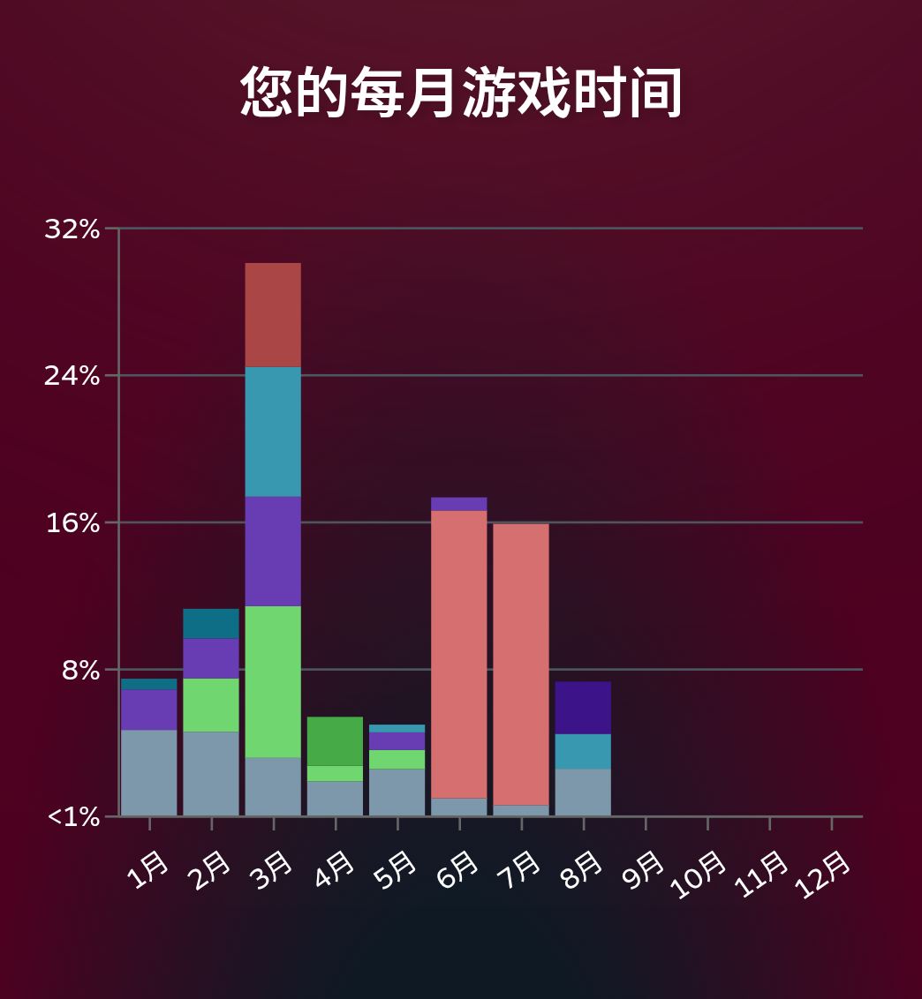
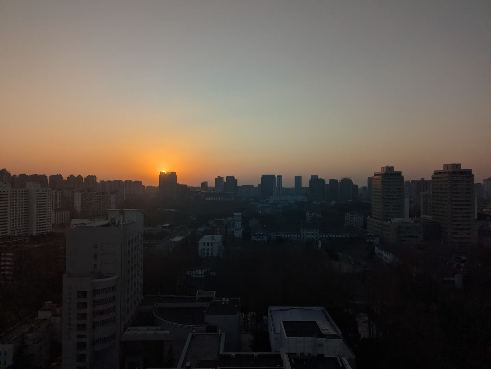
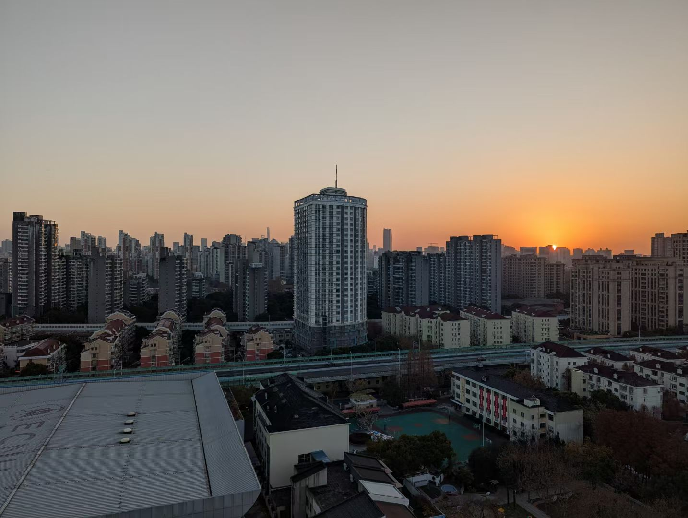
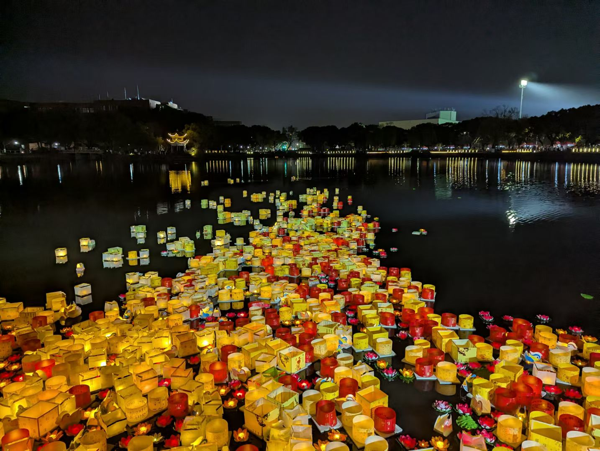

# 大概是年度总结

56 年寒冬首日（不是这记法还真是有够中二的）。
姑且算是过个年吧，整点年度总结什么的。

## 应用年度报告

虽然不是个很喜欢给自己贴标签的人，
但怎么说呢，真方便啊（笑

太久没写正经东西了，
不如先从这里给自己找点灵感。

### BiliBili

依旧音乐播放器这一块没得说。
横向对比一下的话，音乐比其他专门的音乐 App 全不少，
找不到原曲也能找到拿来当背景音乐的视频。

跟 Youtube 和 Niconico 的优势比起来就是
不开会员就可以挂在后台黑听。

不过今年没营养的视频还是刷的太多了。
经常一刷就是半宿，然后导致晚起床。

切片真得少刷，不然纯粹就是破坏了原片的观影体验。

### Github

后半年瓷砖的数量显然上来了，
按照时间顺序的话，
前面零散的应该都是给长庆写的生存手册、
十月底跟十一月初是这个博客、
十一月后半段到十二月中旬是 Times 和 Plus、
然后大概是 Lean 和别的什么了。

看上去可能……还不错？

希望明年能在一些开源项目中做点贡献吧。

### Steam

和上文 Github 瓷砖还真是明显的互补啊，
我似乎已经能预见到以后工作的悲惨生活了（bushi

照着时间轴捋一下好了，每个月取前四个游戏：

1. 一月：
   - 闰跃之年：在亲戚家一个下午打通的，超喜欢这作的知识锁和地图设计，感谢 VS2 大人送我这个游戏；
   - 大富翁：和老姐玩的；
   - 鹅鸭杀：记不清了，大概是和四协那帮家伙玩的吧；
   - 别喂猴子：没那么玩的进去倒是，但是感觉主旨还算有趣。
2. 二月：
   - PUBG：我二月就在打这个吗？
   - 大富翁：依旧老姐；
   - 传送门2：伟大，神中神！我要给月球来上一枪.jpg
   - 画猜：年度团建游戏，应该是和四协以及 NAAU 都玩过。
3. 三月：入了夏日口袋，打算在番剧上映之前推掉，显然失败了，此外入了Tick Hop、战地 1 和战地 5
   - PUBG：和舍友以及咸鱼打的，我是彩笔（笑
   - 夏日口袋：鸥线的前半段，我很好奇我什么时候能全线推完
   - 大富翁：和黄油猫打的，他说我像开了
   - 双人成行：当时打折买的，也是和黄油猫打的，小游戏跟滑雪好玩捏
4. 四月：
   - 超级鸡马：和黄油猫打的，阴b大战阴b说是
   - PUBG：依旧舍友老咸鱼
   - BABA IS YOU：好玩，可惜没玩明白
   - 森林冰火人：童年经典4399小游戏，和黄油猫玩的
5. 五月：
   - 造桥：这我真没印象了，为什么是五月最多的？
   - PUBG：同上
   - 大富翁：同三月
   - A=B：？应该是我给别人安利吧
6. 六月：买了田舍妹
   - 挺进地牢：元气骑士电脑版（bushi），好玩！经常大半夜哀嚎“（你倒是翻）滚啊！快（翻）滚啊！”
   - 大富翁：三人局，依旧像开了
   - VVVVVV：像素风小游戏，期末周复习的时候通掉了
   - 田舍妹：想冲了（点头）
7. 七月：
   - 挺进地牢：同上
   - 冰火人：同四月
8. 八月：
   - 彼方的她：类生命线作品，通了一条线就没开了，按照玩家来看估计后边几条线也值得一玩
   - 夏日口袋：把鸥线结束继续紬线，然后停滞到现在了
   - 田舍妹：嗯……
   - 机械迷城：点点点益智解谜小游戏
9. 九月：无
10. 十月：无
11. 十一月：
    - 泰拉瑞亚：和咸鱼玩过一次，可惜兴趣确实不大
12. 十二月：买了底特律：变人、smee新作、杀戮尖塔和古早街机三合一包

## 从世间走过

### 寒冬

冬至和ニャこ还有黄油猫在宿舍里煮了顿饺子。

去体验了一下空港缐首发，横排座椅舒服，可惜票价太贵了。

闲着没事把二课刷掉了。

元旦按照传统去看了日落日出和零点星空，把日出那张照片做成明信片随机寄给了几个人。

cf round 996 1h57min 一发过 D 上蓝了

### 春

花丸晴琉毕业直播，晴琉琉😭😭😭你不要走晴琉琉😭😭😭

辅修入选了，接着这个机会去参与了友校的水灯节

春末去杭州拍了封电报给慕老师。

### 夏

> 我艹这个夏天过的简直太糟糕了

打了拉面大学的校赛，成绩不错，可惜 C 题差了一个性质没看出来

期末周努力活下来了但是电脑被售后格式化了我\*你\*的\*\*哈批，\*了全家的\*\*东西。

六月依旧白蚁季，宿舍楼道里都是

市赛，因为少输出换行奖项掉了一等…………………………

去参与了 SJTU 的 lean 暑训班，第一次接触到这个语言，有种宿命的预感在啊……

顺便去了 AOSCC ，氛围真好的社区啊（叹

暑假留校集训，热麻了

唉唉，人际关系

### 秋

> 不知道怎么说，复杂的情感，大概从秋天起就陷入到了一个缺少友情的状态

选拔赛打寄了……大概是要退役了……不是很甘心………………

也没能和新认识的高中学弟学妹混熟…………

国庆爽骑了两天的自行车，
速通苏城给江老师寄了封明信片，
然后陪 xp 和他对象在古城逛了三天…………唉唉xql真好

十月底翘了两天课回了趟家，赶上了下雪。
回来后开始搭这个博客，啧，突然想起来有个草稿存了好久没写完。

去友校买了两个螃蟹吃，圆梦了。

和朋友写了 Times 和 Plus ，可惜还不够好……缺少了一些……说不上来的感觉

分流还不错，如愿以偿。

一直想骑去苏城，没去上

### 雪冬

复习复习复习复习期末周学麻了说是

报名了 SCU 的 LEAN 寒假培训班，博一下公费旅游（bushi

## 他人所讲述的故事

### Anime

- 少女终末旅行：好久之前买的，才把漫画看完，打算寒假再回顾一遍番剧和漫画，好喜欢这种末世风。
- 假冒的孩子：开头不错，后边感觉要落入俗套了，第四册还没出，不知道会怎么样。

### Cartoon

- 败犬女主：单身狗看不得这个，太阳光了太青春了感觉要死了
- 来自深渊：嗯……

### Games

旮旯启动少了，我忏悔

- 夏日口袋：只推了鸥线
- 闪耀青春：共通线都没推完

### Novel

- 我和女友的妹妹接吻了：太棒了我要看的就是这种扭曲的剧情啊！！！

### Bokaro

- 海茶、すずぬい：海鲜风味的曲子，今年特别喜欢听
- 花鸟风月：好听的老歌，可惜专辑有价无市收不到
- 史替：你说什么和什么的戴维斯线😰😰😰

## 听筒那端

听筒那端逐渐听不见回声，只剩传来的一阵嘟嘟忙音。

唉唉，人际关系

## 那日炫目的光彩

学习这块也是烂中烂，苦中作乐的是至少数论还有在好好学。

其他的嘛……基本就是东学一点西学一些了

## 因为有一条通向远处的路

苏城杭州，都是一日游，没能留下什么记忆

大概也只能回忆起漫步在苏城楼宇间的场景吧。

## 问点什么？

参考[一起用 15 个问题总结这一年吧！](https://leehenry.top/posts/words_in_wildness/ww-vol04/)

Q01.如果用一个字/词/短语/句子来概括这一年，你会如何描述它？

> 迷茫。我依旧不知道我将要走向何方

Q02. 这一年是否面临了对你而言重要的人生变化？

> 电脑被格式化了，失去了整个高中留下来的聊天记录

Q03. 日常的生活节奏如何？在锻炼、饮食、睡眠方面，有哪些变化与反思？

> 不太像活人，吃饭时间和正常三餐时间完全错开，睡眠时区至少西移了四个时区。睡眠真得调整了（汗

Q04. 在财务管理和储蓄方面是否有变化，有什么有意思的支出吗？

> 修手机算吗（目移
>
> 除此之外大概是下单了 anemoi 的实体版

Q05. 工作或学习上，这一年取得了哪些对你而言具有阶段意义的里程碑？

> 依旧没挂科，分流顺利，以及入选辅修，和同学做了 Times 和 Plus

Q06. 是否发展了一些个人副业或长期兴趣项目？目前的进展与收获如何？

> 完全没有，残念，不过我猜新学的 lean 大概会帮我找到一点方向

Q07. 有哪些让您情绪起伏的瞬间？

> 市赛少输出了换行、电脑被格式化、队友退役

Q08. 是否落泪过，为什么？

> 骑车风吹的

Q09. 尝试了哪些未曾体验的事情？

> 好像……没有诶

Q10. 去到了哪些未曾涉足的空间？

> 通勤路上的十几公里，之前一直是地铁的，这学期时间宽了经常骑车去

Q11. 有哪些对您产生影响的书籍、影视、音乐或游戏作品？其中是否有特别令您印象深刻的人物、角色或观点？

> 少女终末旅行吧，我现在的个性签名就出自那里
>
> > 就算活著沒有意義，偶而還是會碰到好事的。

Q12. 是否进入、发展或结束过一段亲密关系，有什么新的体悟？

> 无

Q13. 哪些朋友对您这一年影响最大？是否结识了新朋友，是如何结识的？

> 黄油猫，打游戏打的。湘，平时聊天。新朋友基本都是在学校群里抓到的。

Q14. 有没有参与到一些社区或圈子的建设、维护或互动，对您而言意味着什么？

> 帮 lean 的中文社区抓了点格式错误，对我来说也就是举手之劳吧

Q15. 面向 2026 年，您最希望实现的三个目标或愿望是什么？

> 1. 把生活习惯（尤其是睡眠）调整好
> 2. 找到乐于从事的兴趣
> 3. 有一段关系真的很好的友情

## 有让自己快乐吗

残念，并没有，我甚至不能直面自己写完这篇总结

（唉不是怎么这么像流水帐啊草，元旦前再完善完善？
